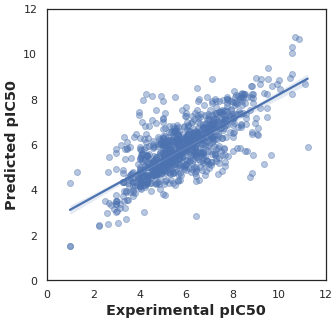
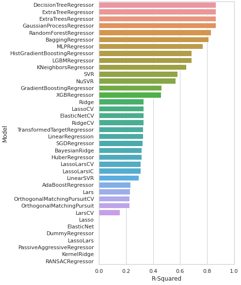

# Bioinformatics-Drug-Discovery

This repository outlines a complete bioinformatics and cheminformatics workflow for accelerating drug discovery. The project focuses on building a machine learning model to predict the bioactivity of chemical compounds against the **Acetylcholinesterase** target protein, a key enzyme in neurobiology.

---

## Project Overview & Goal

In the early stages of drug discovery, identifying promising compounds from millions of candidates is a major challenge.

The primary goal is to develop a robust **Random Forest regression model** that predicts the **pIC50** value—a measure of a substance's potency—based solely on its molecular structure. By doing so, we can efficiently screen and prioritize compounds for further experimental testing, saving significant time and resources.

---

## The Workflow

The project is structured into five sequential Jupyter Notebooks, each representing a critical step in the drug discovery pipeline:

1.  **`DataCollection.ipynb` — Data Acquisition**:

    - Extracts experimental bioactivity data for compounds targeting Acetylcholinesterase from the **ChEMBL** public database.

2.  **`Exploratory data analysis.ipynb` — Data Curation & Analysis**:

    - Cleans and standardizes the raw data.
    - Calculates the pIC50 values from IC50 measurements.
    - Applies **Lipinski's Rule of Five** to evaluate the drug-likeness of the compounds, filtering for molecules with properties favorable for oral administration.

3.  **`Descriptor calculation.ipynb` — Feature Engineering**:

    - Converts the chemical structures (SMILES notation) into numerical representations using molecular descriptors.
    - Specifically, **PubChem Fingerprints** are calculated using the **RDKit** library to capture the structural features of each molecule.

4.  **`Model building.ipynb` — Predictive Modeling**:

    - Uses a **Random Forest Regressor** model to learn the relationship between the molecular fingerprints and the pIC50 values.

5.  **`Model comparison.ipynb` — Performance Evaluation**:
    - Compares the performance of the primary Random Forest model against a suite of other ML algorithms.

---

## How to Run This Project

**1. Install Dependencies:**

Clone the repository:

```bash
git clone https://github.com/ErfanRezaei/Bioinformatics-Drug-Discovery
cd Bioinformatics-Drug-Discovery
```

**2. Execute the Notebooks:**

Run the Jupyter Notebooks in the specified order, as the output of each notebook is the input for the next one.

`1_DataCollection.ipynb` → `2_Exploratory data analysis.ipynb` → ... → `5_Model comparison.ipynb`

---

## Model Performance

The performance of the final **Random Forest Regressor** is visualized in the scatter plot below. The plot compares the pIC50 values predicted by the model against the actual experimental values from the test set:



---

## Model Comparison

To evaluate the effectiveness of different machine learning approaches, a comprehensive comparison of various regression models was performed. The bar plot below ranks the performance of each algorithm based on its R-Squared score:


